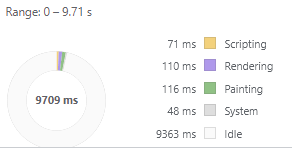
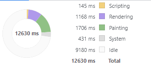

# Level.Works

Task for technical assessent for level.works.

## Description

> Create a grid of 50x50. When you click on a cell, all values in the
> cells in the same row and column are increased by 1. If a cell is
> empty, it will get a value of 1. After each change a cell will briefly
> turn yellow.  
> If 5 consecutive numbers in the Fibonacci sequence
> are next to each other, these cells will briefly turn green and will
> be cleared. Use the programming language of your choice.

## Changing grid size

`app.types.ts` contains a couple of constants that can be changed to update functionality of this task

-   `FLICKER_DURATION` - Specifies the length of different color application. Defaults to 500ms
-   `DEFAULT_SEQUENCE_LENGTH` - Specifies the sequence searched for. As per above description, defaults to 5.
-   `DEFAULT_GRID_SIZE` - specifies the size of the grid. As per above description, defaults to 50

## Libraries used and reasoning

-   code linting tools
-   Angular
    -   Not really used all that much
    -   Could easily be done without Angular/React with almost no changes (only angular concepts used are components, service and renderer)
    -   Used for easy scaffolding with typescript and basic tests

## Grid rendering

-   Grid is done using `div`, causing rendering and repaints fairly slow with more elements (see performance below). For 50x50, it's alright
-   Definitely room for improvement

## Fibonacci sequence calculation

-   Fairly fast
-   Fibonacci is calculated to the 44th number (I do not expect there will be more elements than that)
-   Sequences to color green are done only on updated elements, rather than the entire grid, providing some speed
-   The sequences to color green can be anywhere between 5 to 9
    -   Sequence has to have length of 5
    -   If there is sequence of length 9, it means there are multiple sequences of length 5
    -   Sequence can be either top-down, bottom-up, left-right or right-left

## Asynchronicity

-   There are 2 things that require async updates
    -   Creating yellow "cross" after element is clicked (column and row)
        -   Keeping track of number of clicks so that last clicked cross remains it's color
    -   Creating green "lines" after there are 5 consecutive elements
        -   Similar to yellow coloring
        -   Disables further clicks when a sequence is colored until it is removed (Mainly because I did not know how to approach such changes)

## Speed on local machine:

-   For cell calculation
    -   Grid 50x50 2.5ms
    -   Grid 100x100 3.7ms
    -   Grid 150x150 6s
    -   Grid 200x200 7ms
-   For painting (see images)
    -   Grid 50x50 ~250ms (100 render, rest paiting) (first image)
    -   Grid 200x200 2.8s (1.15s render, 1.7s painting) (second image)

## Availability

-   Preview available on [Github Pages](https://simproch.github.io/level.works/);
